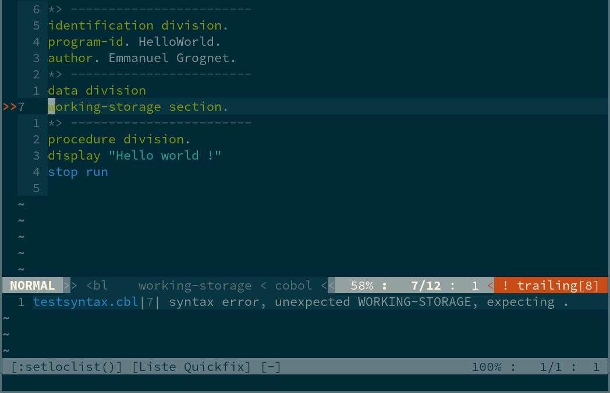

## 🎉 Cobol.nvim 🚧

Collection of useful utilities for COBOL development in neovim. It's lua-update of some cool [plugins](README.md#credits).

### 🌟 Features

+ writing in pure lua
+ adding and removing line numbers in fixed mode.
+ syntax-checker

### ⚡️ Requirements

+ Neovim >= 0.5.0
+ [cobc](https://sourceforge.net/projects/open-cobol/)

### 📦 Installation

Install via your favourite package manager:
#### [packer.nvim](https://github.com/wbthomason/packer.nvim)
```lua
use 'yorik1984/cobol.nvim'
```

### 🚀 Usage

```lua
require('cobol.nvim').setup {
}
```
### Syntax cheker

Vim-cobol-syntax-checker is a vim plugin for check cobol syntax.
The plugin can check syntax on demand or automatically when file is save/open.
Free and strict cobol syntax are supported.
Check is done by the compiler `cobc` (aka [GnuCOBOL](https://sourceforge.net/projects/open-cobol/)).

- you write your code in COBOL
- when you save your code, the plugin run `cobc` and get the result
- if there compile error, errors are displayed in the location list and signs are placed beside lines with errors
- the focus is given on the first line that contains an error



### ⚙️ Configuration

You can add this configuration for customize colors for git and diagnostics:
```lua
require("cobol.nvim").setup {
}
```
```lua
-- Strict/Free Cobol syntax

-- Free modern cobol syntax :

vim.g.cobol_syntax_checker_cobc_compiler_option = '-free'

-- Traditional old cobol syntax (default)

vim.g.cobol_syntax_checker_cobc_compiler_option = ''

-- Check syntax when open cobol file (default)

vim.g.cobol_syntax_checker_check_on_read = 1

-- Check syntax when save cobol file (default)

vim.g.cobol_syntax_checker_check_on_write = 1 

-- Auto open/close location list (default)

vim.g.cobol_syntax_checker_loc_auto_open_close = 1
```

### 🔗 Credits ©️

[vim-cobol-syntax-checker](https://github.com/emmanuelgrognet/vim-cobol-syntax-checker) 
[vim-cobol](https://github.com/emmanuelgrognet/vim-cobol-syntax-checker) 

### 👥 Contributions

Contributions are welcome. Please file issues, send pull requests.

